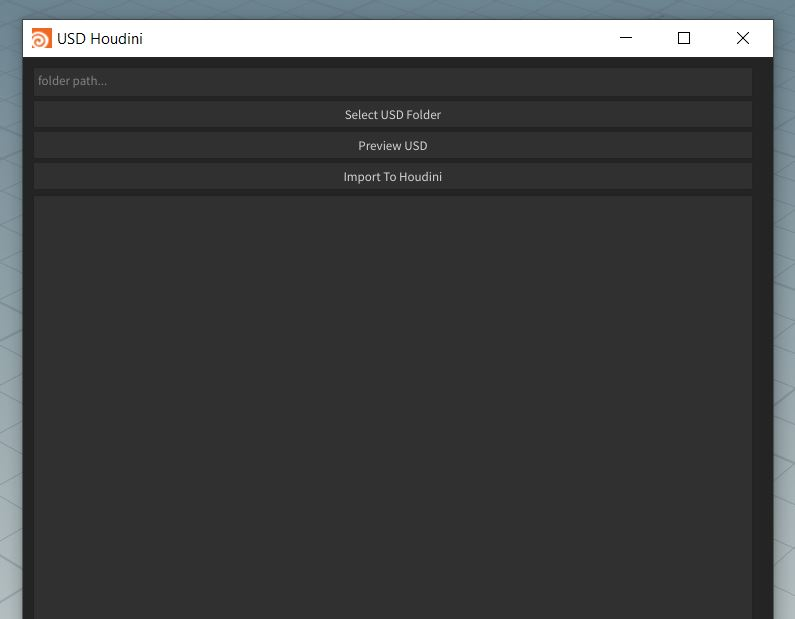
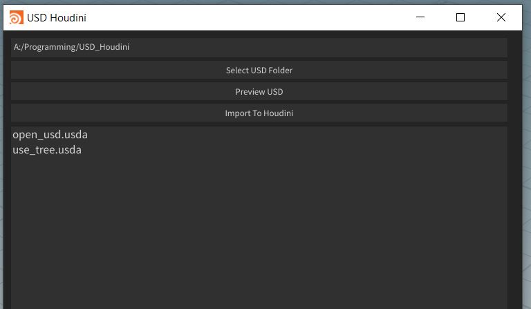
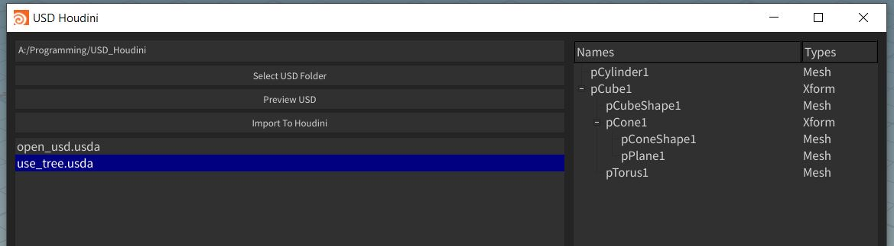
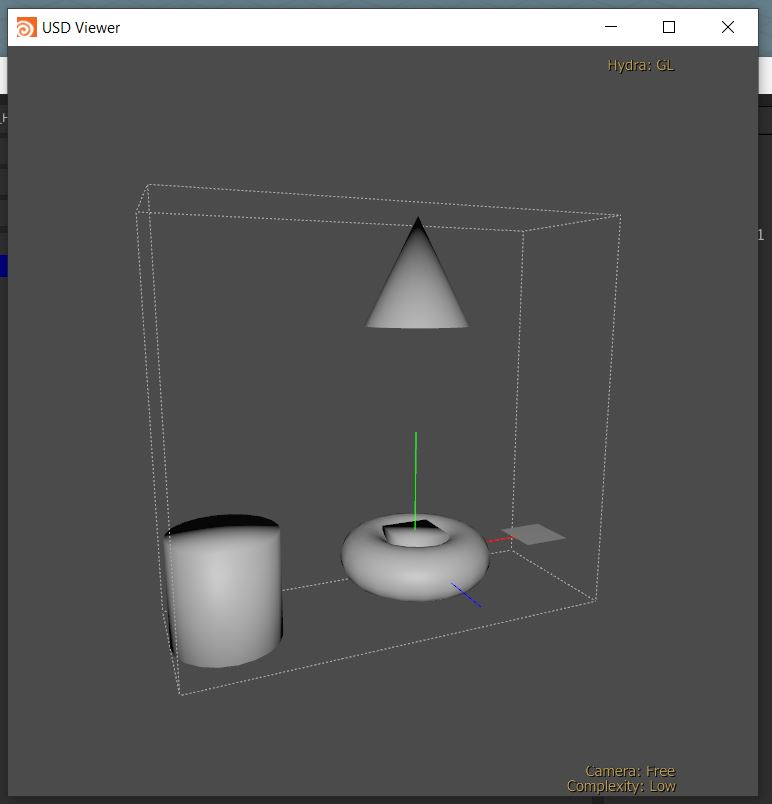

# USD Preview for Houdini

This tool can be used to preview usd file before importing them inside Houdini.

## Selecting USD Folder

To select a USD file, you need to press the "Select USD Folder" button.
You have to choose a folder where your USD files are located.

Once you have selected the folder, all the usd files inside it will be listed below.

## Preview USD File

If you select a USD file, it will show a tree structure of the USD file.

### You can also preview the USD file using the "Preview USD" button

It will render the USD file in a new window

## Import USD File into Houdini

You can import the USD file just by clicking the "Import into Houdini" button !

